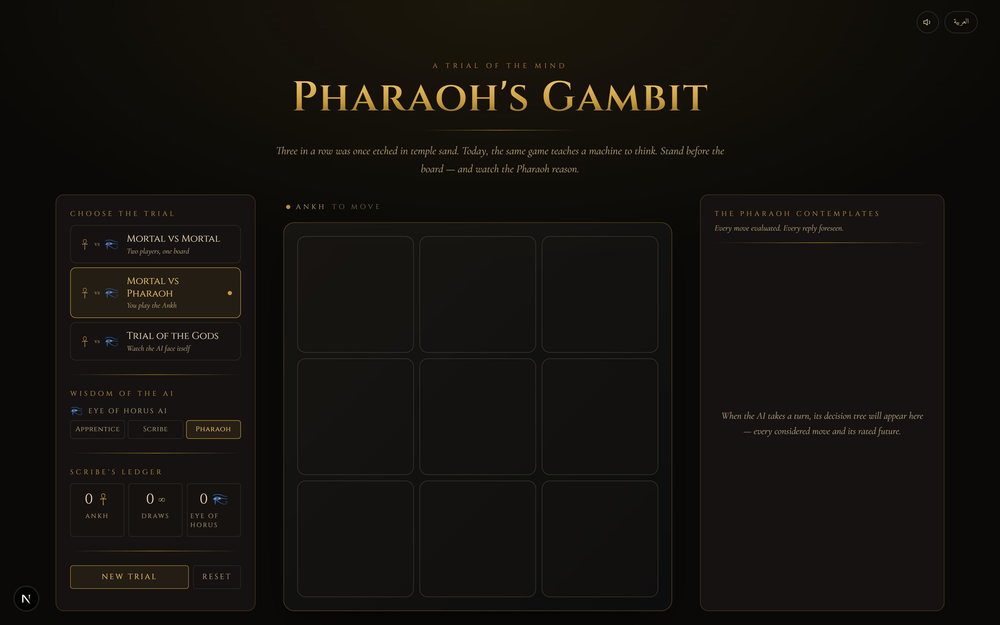
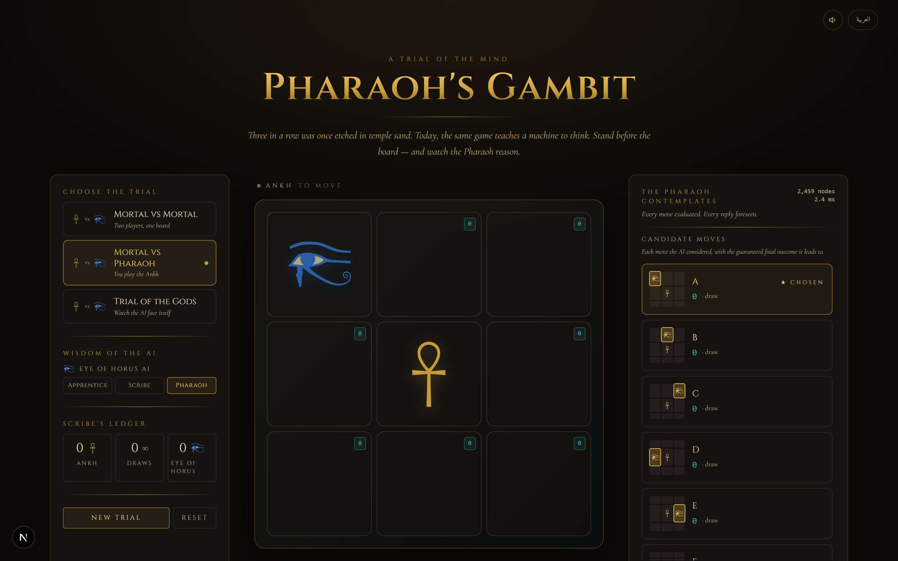
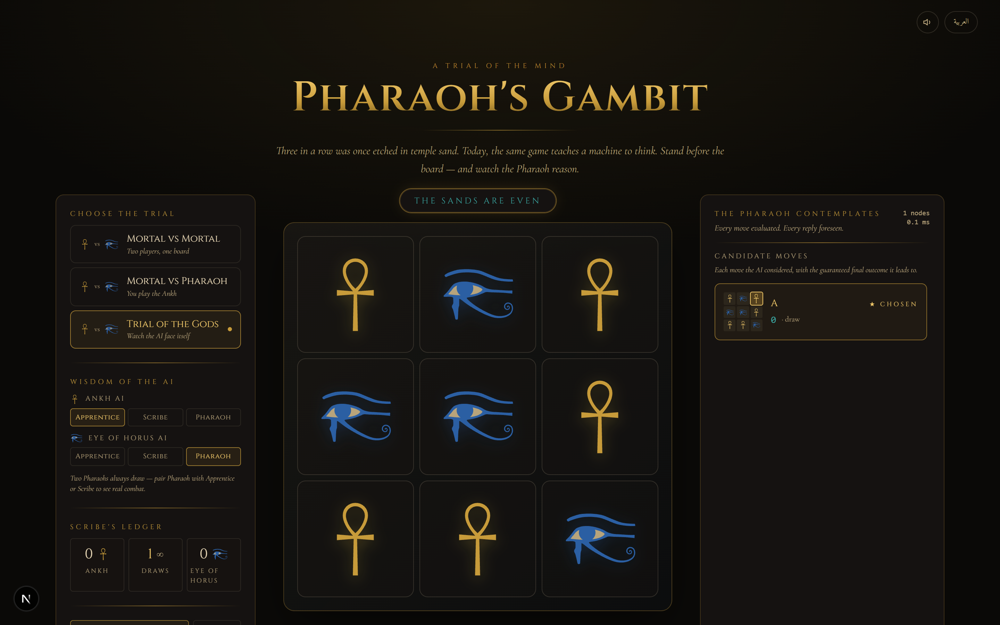
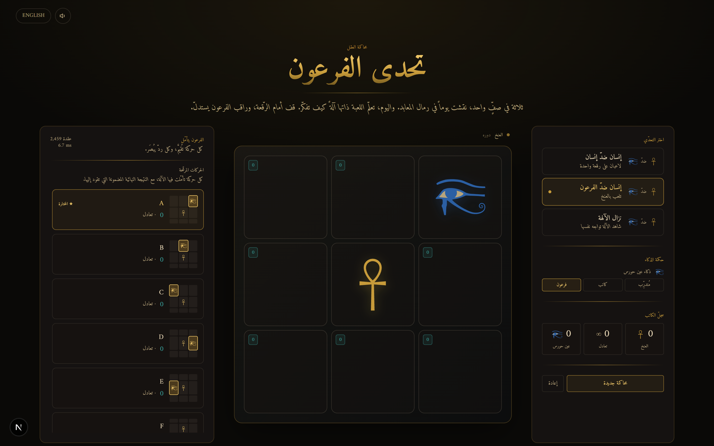

<div align="center">

# Pharaoh's Gambit · تحدّي الفرعون

**Tic-Tac-Toe against an unbeatable Minimax AI — themed as the trials of Ancient Egypt, in English and Arabic.**

[](https://github.com/ahmedEid1/Tic-Tac-Toe/actions/workflows/deploy.yml)
[](LICENSE)
[](https://nextjs.org)
[](https://react.dev)
[](https://tailwindcss.com)
[](#bilingual-support)

### **▶ [Play it live](https://ahmedeid1.github.io/Tic-Tac-Toe/)**



</div>

---

## What is this?

Pharaoh's Gambit is the classic three-in-a-row game, rebuilt as a small piece of interactive teaching material:

- **Play** against a friend, against the Pharaoh, or watch two gods play each other.
- **Watch the AI think** — every move it considered, the guaranteed outcome of each, and the branches it skipped via α-β pruning, all rendered as visual mini-boards.
- **Read the algorithm** — a short scroll explains Minimax, α-β pruning, and the depth-penalty tiebreak that makes the AI prefer faster wins and slower losses.
- **Switch language** — full English / **العربية** with right-to-left layout and a traditional Naskh font.

The Ankh and Eye of Horus glyphs are the canonical Wikimedia Commons public-domain SVGs, rendered inline so the colour scheme stays themable.

---

## Screenshots

<table>
  <tr>
    <td width="50%" valign="top">
      <strong>The Pharaoh, thinking</strong><br/>
      Every empty cell shows the AI's evaluation; the right panel breaks each candidate move into a mini-board with its rated outcome.<br/><br/>
      
    </td>
    <td width="50%" valign="top">
      <strong>A finished trial</strong><br/>
      An Apprentice Ankh AI falls to a Pharaoh Eye AI. The winning row glows; the verdict banner announces the victor.<br/><br/>
      
    </td>
  </tr>
  <tr>
    <td colspan="2" valign="top">
      <strong>العربية — full right-to-left</strong><br/>
      The layout mirrors completely. Title, controls, candidate cards, and scoreboard all flip; the Amiri font carries the headings.<br/><br/>
      
    </td>
  </tr>
</table>

---

## Features

| | |
|---|---|
| **Three modes** | Mortal vs Mortal, Mortal vs Pharaoh, Trial of the Gods (AI v AI) |
| **Three AI tiers** | Apprentice (random), Scribe (depth-2 minimax), Pharaoh (full minimax + α-β + faster-wins tiebreak) |
| **Algorithm visualization** | Every move the AI considered, with mini-board diagrams and plain-language outcome phrasing ("draw", "win in 2", "lose in 4") |
| **Live cell scores** | Each empty cell shows the AI's minimax score for that move |
| **Bilingual** | English & Arabic, with `dir="rtl"` flip and Amiri serif for Arabic |
| **AI vs AI controls** | Play / pause / step / variable speed slider |
| **Scoreboard** | Per-session Ankh / Draws / Eye tally — "Scribe's Ledger" |
| **Synthesized sound** | Token-place thud, win fanfare, draw chime, thinking shimmer — all via Web Audio, no asset files |
| **Authentic glyphs** | Wikimedia public-domain Ankh and Wedjat eye SVGs, rendered inline |
| **Accessible** | `aria-label`s on every control, keyboard-actionable cells, no-motion-friendly transitions |
| **Static** | Exports as a fully static site — runs anywhere a CDN can serve files |

---

## How the Pharaoh thinks

The AI is a textbook Minimax search with three improvements:

1. **Terminal scoring with depth penalty** — wins are worth `10 − depth`, losses `−10 + depth`. A win in two plies is worth more than a win in four; a loss in four plies is preferable to a loss in two. This is what makes an unbeatable AI feel *aggressive*.
2. **α-β pruning** — branches that cannot improve on what's already on the table are skipped; the visualization flags them as `pruned`.
3. **Depth-limited mode (Scribe)** — minimax cut off at 2 plies, giving a realistically beatable opponent. Useful for showing how the search depth changes the AI's choices.

The full algorithm lives in [`src/lib/minimax.ts`](src/lib/minimax.ts) — under 200 lines, pure, fully covered by the on-screen visualization.

---

## Tech stack

- **[Next.js 16](https://nextjs.org)** (App Router, Turbopack, static export)
- **[React 19](https://react.dev)**
- **[TypeScript 5](https://www.typescriptlang.org)**
- **[Tailwind CSS v4](https://tailwindcss.com)** with `@theme` tokens
- **[Zustand](https://github.com/pmndrs/zustand)** for game state and the i18n store (with `persist` middleware for locale)
- **[Framer Motion](https://www.framer.com/motion/)** for entry/exit animations and the verdict banner
- **Web Audio API** — synthesized in-browser, zero audio assets
- **`next/font`** — Cinzel (English display), Cormorant Garamond (English body), Amiri (Arabic)
- **GitHub Actions** deploys a static export to GitHub Pages on every push to `main`

---

## Bilingual support

Locale is stored in a tiny Zustand slice with `localStorage` persistence so it survives reloads. A `LocaleEffect` client component syncs `document.documentElement.lang` and `dir` so that native `:lang(ar)` and `[dir="rtl"]` CSS selectors light up — used for font swap and any direction-aware layout. All strings live in [`src/lib/i18n.ts`](src/lib/i18n.ts).

Egyptian-accurate naming throughout:

| EN | AR | Meaning |
|---|---|---|
| Pharaoh's Gambit | تحدّي الفرعون | "The Pharaoh's Challenge" |
| Trial of the Gods | نزال الآلهة | "Contest of the Gods" |
| Pharaoh / Scribe / Apprentice | فرعون / كاتب / مُتدرِّب | The three AI tiers |
| Glory to the Ankh | المجد للعنخ | Victory banner |
| The Sands Are Even | تساوت الرّمال | Draw banner |

---

## Run locally

```bash
git clone https://github.com/ahmedEid1/Tic-Tac-Toe.git
cd Tic-Tac-Toe
npm install
npm run dev
```

Open <http://localhost:3000> in your browser.

### Other scripts

| Script | What it does |
|---|---|
| `npm run dev` | Start the Turbopack dev server |
| `npm run build` | Produce a static export in `out/` (set `NEXT_PUBLIC_BASE_PATH` if hosting under a sub-path like GitHub Pages) |
| `npm run lint` | Lint with ESLint (the Next.js config) |
| `node scripts/screenshots.mjs` | Regenerate the README screenshots (requires the dev server running) |

---

## Deploying

The repo ships with a GitHub Actions workflow at [`.github/workflows/deploy.yml`](.github/workflows/deploy.yml) that builds a static export with `NEXT_PUBLIC_BASE_PATH=/Tic-Tac-Toe` and publishes to **GitHub Pages** on every push to `main`. The workflow auto-enables Pages on the first run.

To deploy your own fork:

1. Fork the repo. It must be **public** for Pages to work on the free plan.
2. Open **Settings → Pages** and confirm **Source = GitHub Actions** (the workflow does this for you on the first run; set it manually if needed).
3. Push to `main` (or trigger the workflow from the Actions tab). The live URL appears once the run completes.
4. If your repo isn't named `Tic-Tac-Toe`, update `NEXT_PUBLIC_BASE_PATH` in `deploy.yml`.

`npm run build` produces a fully static export in `out/` — usable with any static host (Netlify, Cloudflare Pages, S3, nginx, …). On a root domain leave `NEXT_PUBLIC_BASE_PATH` unset; under a sub-path set it to the path, e.g. `/Tic-Tac-Toe`.

---

## Project layout

```
src/
  app/
    layout.tsx          Root layout (fonts, metadata, LocaleEffect)
    page.tsx            Page composition
    globals.css         Tailwind v4 theme tokens + small custom utilities
  components/
    game/               Board2D, PieceToken
    glyphs/             AnkhGlyph, EyeOfHorusGlyph (the SVGs)
    ui/                 Header, ModeSelector, DifficultySelector,
                        Scoreboard, GameControls, ThinkingPanel,
                        AlgorithmExplainer, VerdictBanner,
                        SoundToggle, LanguageToggle, Footer
    system/             LocaleEffect (syncs html lang/dir to store)
  lib/
    game.ts             Pure game logic — board, winner detection
    minimax.ts          The AI search + tree recording
    sound.ts            Web Audio synthesis (no asset files)
    types.ts            Shared types
    i18n.ts             EN + AR strings, locale store, outcome formatter
  store/
    gameStore.ts        Zustand game store — board, mode, AI loop
public/
  ankh.svg              Wikimedia public-domain Ankh
  eye-of-horus.svg      Wikimedia public-domain Wedjat
  favicon.svg           Ankh-shaped favicon
  screenshots/          README + OG images
scripts/
  screenshots.mjs       Regenerates the README screenshots
.github/workflows/
  deploy.yml            Build + deploy to GitHub Pages
  ci.yml                Lint + build on every PR
```

---

## Credits

- **Ankh** SVG — [Wikimedia Commons, public domain](https://commons.wikimedia.org/wiki/File:Ankh_(SVG)_01.svg)
- **Eye of Horus** SVG — [Wikimedia Commons, public domain](https://commons.wikimedia.org/wiki/File:Eye_of_Horus_bw.svg)
- **Cinzel** — Natanael Gama, [Open Font License](https://fonts.google.com/specimen/Cinzel)
- **Cormorant Garamond** — Christian Thalmann, [Open Font License](https://fonts.google.com/specimen/Cormorant+Garamond)
- **Amiri** — Khaled Hosny, [Open Font License](https://fonts.google.com/specimen/Amiri)

---

## License

[MIT](LICENSE) — do whatever you like with it.

<div align="center">
<sub>Built with ☥. ❤️ stars, forks, and pull requests welcome.</sub>
</div>
