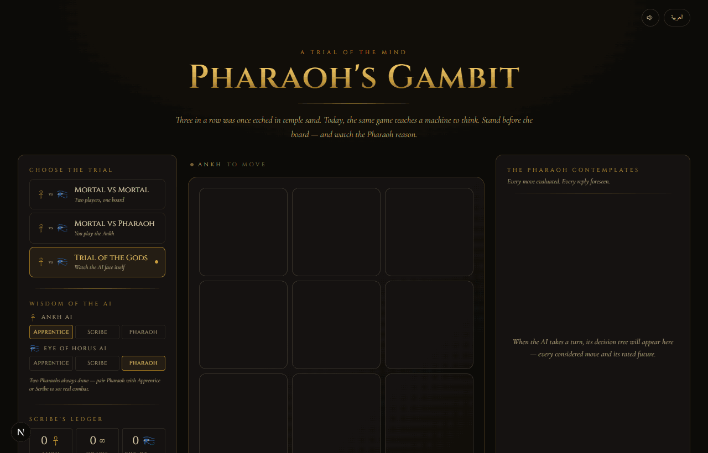

<div align="center">

# Pharaoh's Gambit · تحدّي الفرعون

**Tic-Tac-Toe against an unbeatable Minimax AI — themed as the trials of Ancient Egypt, in English and Arabic.**

[](https://github.com/ahmedEid1/Tic-Tac-Toe/actions/workflows/deploy.yml)
[](https://github.com/ahmedEid1/Tic-Tac-Toe/actions/workflows/ci.yml)
[](LICENSE)
[](https://github.com/ahmedEid1/Tic-Tac-Toe/releases)

### **▶ [Play it live](https://ahmedeid1.github.io/Tic-Tac-Toe/)**



</div>

---

## Glory to the victor


When the trial ends, the winning row glows gold and a verdict banner names the victor — *Glory to the Ankh*, *Glory to the Eye of Horus*, or *The Sands Are Even*.

---

## The Pharaoh, thinking


Every empty cell shows the AI's minimax score in-place. The right-hand panel breaks each candidate move into a mini-board diagram with its rated outcome — *win in 2*, *draw*, *lose in 4*. The chosen move wears the gold star.

---

## العربية — right-to-left


The whole interface mirrors. Title, controls, candidate cards, scoreboard — all flip. Arabic is set in the **Amiri** traditional Naskh face. Naming is faithful to Egyptian myth — *تحدّي الفرعون* (Pharaoh's Challenge), *نزال الآلهة* (Contest of the Gods), *تساوت الرّمال* (the sands have evened).

---

## Features

| | |
|---|---|
| **Three modes** | Mortal vs Mortal, Mortal vs Pharaoh, Trial of the Gods (AI v AI) |
| **Three AI tiers** | Apprentice (random), Scribe (depth-2 minimax), Pharaoh (full minimax + α-β + faster-wins tiebreak) |
| **Algorithm visualization** | Every move the AI considered, as a mini-board diagram with a plain-language outcome |
| **Live cell scores** | Each empty cell shows the AI's minimax score for that move |
| **Bilingual** | English & Arabic with `dir="rtl"` flip and Amiri serif |
| **AI vs AI controls** | Play / pause / step / variable-speed slider |
| **Scoreboard** | Per-session Ankh / Draws / Eye-of-Horus tally — *Scribe's Ledger* |
| **Synthesized sound** | Token-place, win fanfare, draw chime, thinking shimmer — Web Audio, no asset files |
| **Authentic glyphs** | Wikimedia public-domain Ankh and Wedjat-eye SVGs, rendered inline so colour is themable |
| **Mobile responsive** | Board stacks above sanctum above thinking panel on narrow viewports |
| **Tested** | 25 unit tests covering game logic and minimax correctness (immediate wins, blocks, faster-win tiebreak, never-loses-to-random, α-β pruning) |
| **Static** | Exports as a fully static site — runs anywhere a CDN can serve files |

---

## How the Pharaoh thinks

The AI is a textbook Minimax search with three refinements:

1. **Depth-penalty terminal scoring** — wins are worth `10 − depth`, losses `−10 + depth`. A win in two plies is worth more than a win in four; a loss in four plies is preferable to a loss in two. This is what makes an unbeatable AI feel *aggressive*.
2. **α-β pruning** — branches that cannot improve on what's already on the table are skipped; the visualization flags them as `pruned`.
3. **Depth-limited mode (Scribe)** — minimax cut off at 2 plies, giving a realistically beatable opponent. Useful for showing how search depth changes the AI's choices.

The full algorithm lives in [`src/lib/minimax.ts`](src/lib/minimax.ts) — under 200 lines, pure, fully covered by the on-screen visualization and the test suite.

---

## Tech

[Next.js 16](https://nextjs.org) (App Router, Turbopack, static export) ·
[React 19](https://react.dev) ·
[TypeScript 5](https://www.typescriptlang.org) ·
[Tailwind CSS v4](https://tailwindcss.com) ·
[Zustand](https://github.com/pmndrs/zustand) ·
[Framer Motion](https://www.framer.com/motion/) ·
Web Audio ·
Vitest ·
GitHub Actions

---

## Run locally

```bash
git clone https://github.com/ahmedEid1/Tic-Tac-Toe.git
cd Tic-Tac-Toe
npm install
npm run dev    # http://localhost:3000
npm test       # 25 unit tests
```

To deploy your own fork: the repo's [`deploy.yml`](.github/workflows/deploy.yml) workflow builds a static export with `NEXT_PUBLIC_BASE_PATH=/Tic-Tac-Toe` and publishes to GitHub Pages on every push to `main`. Fork must be public for the free plan; the workflow auto-enables Pages on first run.

---

## Credits

- **Ankh** — [Wikimedia Commons, public domain](https://commons.wikimedia.org/wiki/File:Ankh_(SVG)_01.svg)
- **Eye of Horus** — [Wikimedia Commons, public domain](https://commons.wikimedia.org/wiki/File:Eye_of_Horus_bw.svg)
- **Fonts** — [Cinzel](https://fonts.google.com/specimen/Cinzel), [Cormorant Garamond](https://fonts.google.com/specimen/Cormorant+Garamond), [Amiri](https://fonts.google.com/specimen/Amiri) — all SIL Open Font License

---

[MIT](LICENSE)
